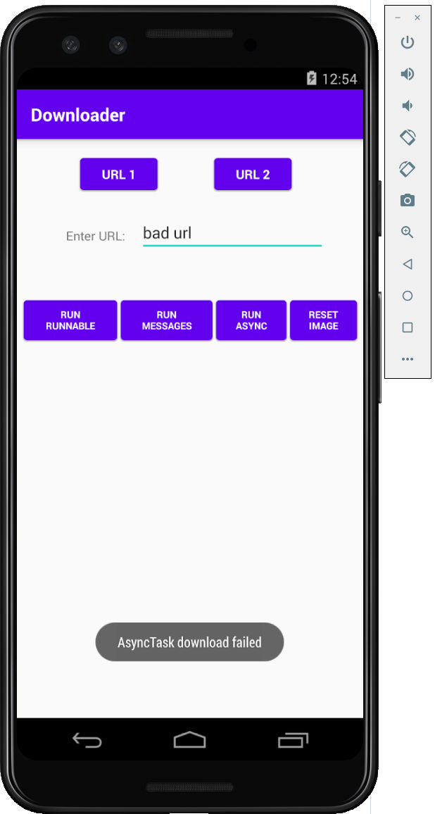

# DownloaderApp

Downloader app that handles multi-threaded downloading of images from URLs.

Instructions to run:
1. Open project in Android Studio
2. Configure device to API 19
3. Build app

    
    
Download Success

    
    
Bad URL Download failed

